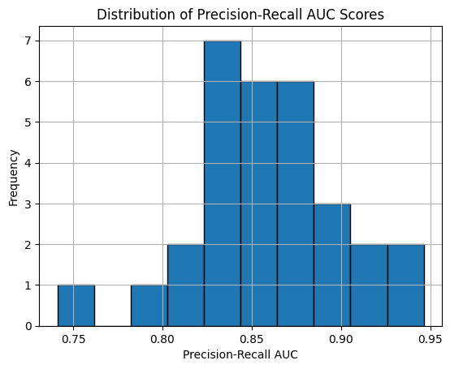

# Credit Card Fraud Detection using XGBoost Classifier

## Introduction


This Python script demonstrates the use of machine learning for credit card fraud detection. By leveraging the XGBoost classifier and evaluating the Precision-Recall Area Under Curve (PR AUC) metric, the script aims to accurately identify fraudulent transactions in a given dataset. With the prevalence of credit card fraud, this tool provides an efficient means of safeguarding financial transactions and maintaining trust in the banking system.

## Prerequisites
- Python 3
- Required libraries:
  - numpy
  - pandas
  - matplotlib
  - scikit-learn
  - xgboost

You can install these dependencies using pip:
```bash
pip install numpy pandas matplotlib scikit-learn xgboost

```

## Usage
1. Clone or download the repository.
2. Place your dataset file (creditcard.csv) in the same directory as the Python script.
3. Open the Python script (precision_recall_auc_evaluation.py) and adjust the filename variable to match the name of your dataset file if it's   different.
5. Run the file : CreditCardFraudDetection.ipynb
6. The script will load the dataset, preprocess it, train an XGBoost classifier, and evaluate its performance using Precision-Recall AUC via cross-validation.
7. The script will output the mean accuracy and standard deviation of the cross-validation scores.


## Description
- The dataset should be in CSV format with features in columns and the target variable in the last column.
- here is the link of dataset [Credit Card Fraud Detection Dataset on Kaggle](https://www.kaggle.com/datasets/mlg-ulb/creditcardfraud)
- The script preprocesses the dataset, splits it into input features (X) and target variable (y), and evaluates the model using Repeated  Stratified K-Fold cross-validation.
- The evaluation metric used is Precision-Recall AUC, which is suitable for imbalanced classification tasks like fraud detection.
- The XGBoost classifier is configured with 100 estimators.


## Output


## Contribution
Contributions are welcome! If you have suggestions, feature requests, or want to report bugs, please open an issue or submit a pull request.

## License
This project is licensed under the MIT License.

## Acknowledgements
- Kaggle for providing the dataset.
- Open-source libraries and communities for valuable resources and support.
