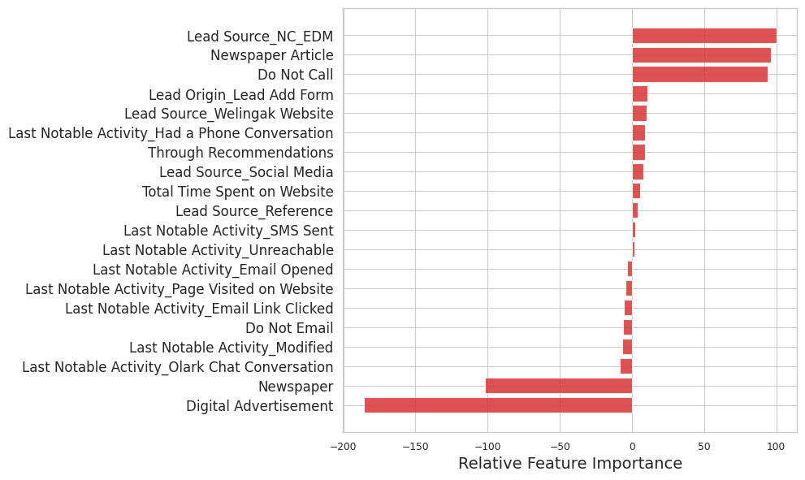

# Lead Conversion Prediction Model

## Overview


In today's competitive business environment, it's crucial for organizations to efficiently convert leads into customers. This project presents a predictive model designed to forecast the likelihood of lead conversion based on historical data and various lead attributes. By leveraging machine learning techniques, we aim to assist businesses in prioritizing leads, optimizing marketing strategies, and ultimately improving conversion rates.

## Key Features

### 1. Data Preparation and Exploration

- **Data Cleaning**: The dataset undergoes preprocessing steps to handle missing values, outliers, and data inconsistencies.
- **Exploratory Data Analysis (EDA)**: Insights are gained through visualizations and statistical summaries to understand the distribution and relationships among variables.

### 2. Feature Engineering

- **Creation of New Features**: Additional features are engineered from existing ones to capture more information and improve model performance.
- **Encoding Categorical Variables**: Categorical variables are transformed into numerical representations suitable for modeling.

### 3. Model Building

- **Logistic Regression**: The core predictive model utilizes logistic regression due to its interpretability and effectiveness in binary classification tasks.
- **Training and Validation**: The dataset is split into training and validation sets for model training and evaluation, respectively.
- **Model Selection**: Various model evaluation metrics such as accuracy, precision, recall, F1 score, ROC curve, and AUC are utilized to select the best-performing model.

### 4. Model Evaluation

- **Performance Metrics**: The model's performance is assessed using a variety of metrics to gauge its accuracy and reliability.
- **Cross-Validation**: Cross-validation techniques are employed to ensure the model's robustness and generalization capability.

### 5. Lead Scoring

- **Conversion Probability**: Each lead is assigned a conversion probability score based on the model's predictions.
- **Lead Prioritization**: Leads are ranked according to their conversion probability scores, enabling prioritization of high-potential leads.

## Usage

### Installation

1. Clone the repository:

   ```bash
   git clone https://github.com/yourusername/lead-conversion-prediction.git


2. Navigate to the project directory:

```bash
cd lead-conversion-prediction
```

3. Install dependencies:
```bash
pip install -r requirements.txt
```


### Running the Model
- Open the Jupyter Notebook Lead_Conversion_Prediction.ipynb in your preferred environment.
- Execute the cells in the notebook sequentially to train the model, evaluate performance, and make predictions.
- Follow the instructions and comments in the notebook for detailed guidance.

## Lead Conversion Probability Analysis

### Feature Importance:

Based on our model, the following features contribute the most to the successful conversion of leads:

1. **Tags_Lost to EINS**
2. **Tags_Closed by Horizzon**
3. **Tags_Will revert after reading the email**
4. **Lead Source_Welingak Website**
5. **What is your current occupation_Working Profes...**
6. **Last Activity_SMS Sent**
7. **What is your current occupation_Unemployed**

And conversely, the following features indicate a decrease in lead conversion probability:

1. **Tags_switched off**
2. **Tags_Ringing**
3. **Tags_Already a student**
4. **Tags_Not doing further education**
5. **Tags_Interested in full-time MBA**
6. **Lead Quality_Worst**
7. **Tags_Interested in other courses**
8. **Tags_opp hangup**
9. **Asymmetrique Activity Index_03.Low**

### Sensitivity and Specificity:

- By adjusting the probability threshold, we can manipulate the sensitivity and specificity of the model. 
- Increasing the threshold increases specificity but decreases sensitivity, and vice versa.
- High sensitivity ensures that almost all leads likely to convert are correctly predicted.
- High specificity ensures that leads on the brink of conversion are accurately identified.

These observations provide valuable insights into the factors influencing lead conversion and the trade-offs between sensitivity and specificity in model prediction.




### Results
After running the notebook, you will obtain:

- **Model Performance Metrics**: Accuracy, precision, recall, F1 score, ROC curve, and AUC values on both training and validation datasets.
- **Lead Predictions**: Predicted conversion probabilities and lead scores for individual leads.
- **Visualizations**: Graphical representations of the model's performance, feature importance, and ROC curve.


### Contributing
Contributions to this project are welcome! If you find any issues or have suggestions for improvements, please feel free to open an issue or submit a pull request.

