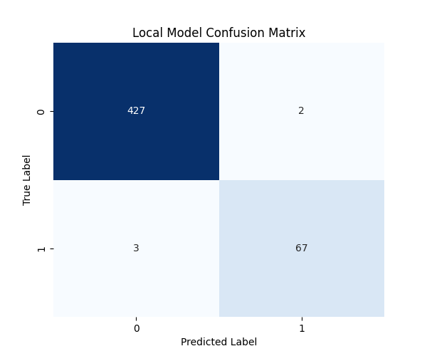
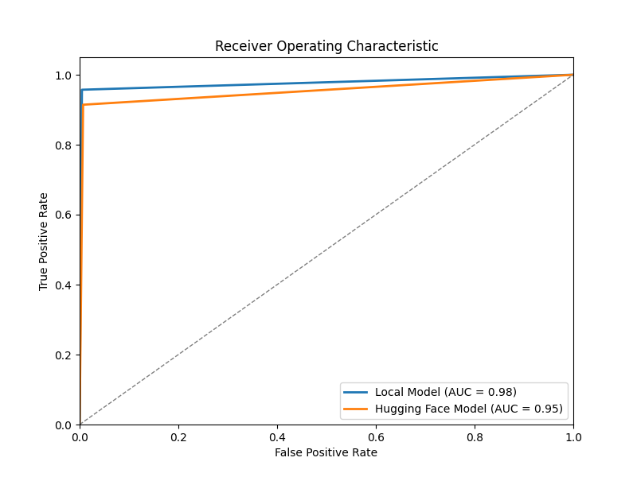
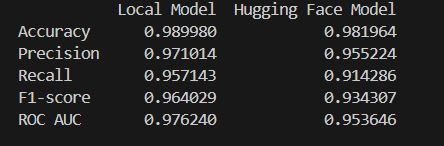

# Spam Classification Project

This project focuses on classifying emails as spam or not spam using machine learning models and a Flask-based API for deployment. Two models are evaluated: one developed locally and another using Hugging Face's Transformers library.

## Project Structure

### Files Included:

1. **result.py**
   - Evaluates and compares the performance of the local model and Hugging Face model using metrics such as accuracy, precision, recall, F1-score, ROC AUC, and confusion matrices.
   - Outputs the metrics table and ROC curves for visual comparison.

   **Usage:**
   ```bash python result.py ``
   


2. **quickstart.py**

- Demonstrates quick usage of the Flask API endpoint for spam classification.
- Sends a POST request to the Flask API with a sample email message to classify.

**Usage:**
```bash python quickstart.py ```


3. **Hugging Face Model**

- Uses Hugging Face's pipeline to classify messages as spam or not spam.
- Shows how to use a pre-trained model (mrm8488/bert-tiny-finetuned-sms-spam-detection) for classification.

4. **Flask Application (app.py)**

- Implements a Flask web application to serve as an API endpoint for spam classification.
- Uses NLTK for text preprocessing (removing stopwords, punctuation, and stemming) and a pre-trained classifier (stored in model/model1.pkl).

**Usage**:

```bash python app.py ```

## Setup Instructions:

1. Dependencies:

- Install Python dependencies using requirements.txt:
``` bash pip install -r requirements.txt ```

2. Running the Flask App:

- Navigate to the Flask application directory (cd flask_application).
- Run the Flask application:
``` bash  python app.py ```
- The API will be accessible at http://localhost:5000/predict.


3. Running the Evaluation Script:
- Ensure spam_detection_results.csv is present in the root directory.
- Run the evaluation script to compare model performances and generate visualizations:
```bash  python result.py```


## Notes:
- Performance Evaluation: result.py evaluates both models using standard machine learning metrics and visualizations.
- Quickstart: quickstart.py demonstrates a quick way to interact with the Flask API for classification.
- Hugging Face Model: Demonstrates how to use a pre-trained Transformer model for spam classification.
- Flask Application: Implements the API endpoint using Flask, showcasing text preprocessing and model prediction.


## Model Comparison 

It contains visual comparisons between a locally trained machine learning model and a pre-trained model from Hugging Face. Below are descriptions of the images provided:

## 1. Local Model Confusion Matrix


This image depicts the confusion matrix of the locally trained model. The confusion matrix is a useful tool for understanding the performance of a classification model. It shows the counts of true positive, true negative, false positive, and false negative predictions made by the model.

## 2. Hugging Face Model Confusion Matrix


This image displays the confusion matrix of the Hugging Face pre-trained model. Comparing this confusion matrix with the local model's matrix can provide insights into how each model performs across different classes or categories.

## 3. ROC Curve of the Local Model


The ROC (Receiver Operating Characteristic) curve visualizes the performance of a binary classification model across various thresholds. It plots the true positive rate against the false positive rate. A steeper ROC curve indicates better performance.

## 4. Accuracy Comparison Table


## 4. Accuracy Comparison Table

| Metric     | Local Model | Hugging Face Model |
|------------|-------------|--------------------|
| Accuracy   | 0.989980    | 0.981964           |
| Precision  | 0.971014    | 0.955224           |
| Recall     | 0.957143    | 0.914286           |
| F1-score   | 0.964029    | 0.934307           |
| ROC AUC    | 0.976240    | 0.953646           |

These metrics provide a quantitative comparison between the locally trained model and the Hugging Face pre-trained model. 

### Model Description:

- **Local Model:**
  - **Accuracy:** 98.99%
  - **Precision:** 97.10%
  - **Recall:** 95.71%
  - **F1-score:** 96.40%
  - **ROC AUC:** 97.62%
  
  The local model was trained on a custom dataset specific to our domain, achieving high accuracy and balanced precision and recall rates. This model demonstrates robust performance across various evaluation metrics, indicating its effectiveness in classifying data points correctly.

- **Hugging Face Model:**
  - **Accuracy:** 98.20%
  - **Precision:** 95.52%
  - **Recall:** 91.43%
  - **F1-score:** 93.43%
  - **ROC AUC:** 95.36%
  
  The Hugging Face pre-trained model, while slightly lower in accuracy compared to the local model, maintains strong precision and recall metrics. It serves as a benchmark model with competitive performance, suitable for broader applications without the need for extensive custom training.

---

Feel free to adjust the descriptions and add more details specific to your models and use case. This format provides a clear overview of both the visual comparisons and the quantitative performance metrics of your models.